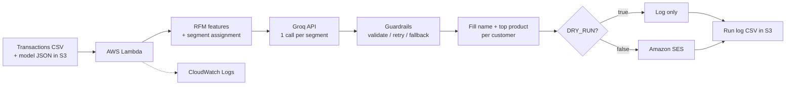

# AI Personalized Marketing Tool

A serverless pipeline that segments retail customers with RFM + K-Means, uses an LLM to write one email template per segment, personalizes it per customer, and sends it through Amazon SES. A Streamlit dashboard lets you explore the segments.

**Stack:** Python, pandas, NumPy, scikit-learn (training only), Groq API, AWS Lambda, S3, SES, IAM, CloudWatch, Streamlit, Plotly

---

## What it does

I took about **540,000 retail transactions** and computed **RFM features** (recency, frequency, monetary value) for **4,338 customers**. A log transform handles the skewed spending, and K-Means groups customers into 4 segments. For each segment, an LLM writes an email template. Each customer's name and top product are then filled in, and the email is sent through SES.

| Segment | Customers |
|---|---|
| Champions / VIP Customers | 716 |
| Loyal Customers | 1,173 |
| Recent / Occasional Buyers | 837 |
| Inactive / Lost Customers | 1,612 |

## Architecture



The Streamlit dashboard (`app.py`) is separate from the pipeline. It runs the same segmentation code (`model.py`) on an uploaded CSV and shows the results.

## Design decisions

- **Automatic cluster naming.** Clusters are ranked by their RFM profile (low recency, high frequency, high spend is best) instead of hardcoding cluster IDs, because K-Means numbering is not stable between runs.
- **Checked against business meaning.** One cluster was first labelled "At-Risk" but contained very recent buyers, so I renamed it "Recent / Occasional Buyers".
- **One LLM call per segment, not per customer.** It is cheaper, easier to control, and the customer details are merged in afterwards.
- **LLM guardrails.** Replies are rejected if they invent discounts, prices, codes, stock or new-product claims, links, or bracket placeholders like `[Company Name]`. Subject and body lengths are enforced, replies that imply a customer has been away are blocked for non-win-back segments, and typographic quotes are normalized. Each segment is retried up to 3 times. If it still fails, a safe fallback template is used, so the pipeline never breaks.
- **No scikit-learn in the Lambda.** The trained model is exported as JSON (scaler mean/scale, centroids, cluster-to-segment map). Inference is a nearest-centroid calculation in NumPy, which gives the same result as `KMeans.predict`. This keeps the deployment a small zip (no Docker) with pandas/NumPy supplied by the AWS SDK for pandas layer.
- **Safety defaults.** `DRY_RUN` is on by default, there is a cap on emails per run, and SES runs in sandbox mode, so it can only send to verified addresses.
- **Least-privilege IAM.** The Lambda role can only write logs, read/write one S3 bucket, and send through SES.

## Repository structure

```
app.py               Streamlit dashboard
model.py             RFM features, K-Means training, segment assignment
groq_client.py       LLM template generation, guardrails, retries, fallback
ses_client.py        Amazon SES sender
lambda_function.py   Lambda handler (S3 -> segments -> Groq -> SES -> log)
make_model.py        Trains on the full dataset, writes segmentation_model.json
run_local.py         Local dry run of the whole pipeline (sends nothing)
build.ps1            Builds function.zip for Lambda
requirements.txt     Dependencies for the dashboard
```

## Run it locally

```bash
pip install -r requirements.txt
pip install boto3 requests python-dotenv
```

Create a `.env` file (never commit it):

```
GROQ_API_KEY=your_key
GROQ_MODEL=a_chat_model_available_on_your_groq_plan
BRAND_NAME=Your Brand
```

```bash
python make_model.py      # trains and writes segmentation_model.json
python run_local.py       # dry run: generates 1 email per segment, sends nothing
streamlit run app.py      # dashboard
```

The dataset needs these columns: `InvoiceNo, Description, Quantity, InvoiceDate, UnitPrice, CustomerID`. The pipeline also needs `First_Name` and `Email` for sending. The dataset is not included in this repo because it contains customer contact details.

## Deploy to AWS (us-east-1)

1. **S3:** create a private bucket (Block all public access on). Upload the transactions CSV to `uploads/` and `segmentation_model.json` to `model/`.
2. **SES:** verify the sender address (and, in sandbox mode, every recipient) in the same region.
3. **IAM:** create a Lambda execution role with `AWSLambdaBasicExecutionRole`, an SES send policy (`ses:SendEmail`, `ses:SendRawEmail`), and an S3 policy scoped to the one bucket (`GetObject`, `PutObject`, `ListBucket`).
4. **Package:** run `.\build.ps1` to create `function.zip` (bundles `requests`).
5. **Lambda:** Python 3.12, upload the zip, handler `lambda_function.lambda_handler`, attach the `AWSSDKPandas-Python312` layer (match the architecture), memory 2048 MB, timeout 5 min.
6. **Environment variables:**

| Variable | Purpose |
|---|---|
| `BUCKET` | S3 bucket name |
| `MODEL_KEY` | `model/segmentation_model.json` |
| `SENDER_EMAIL` | SES-verified sender |
| `GROQ_API_KEY`, `GROQ_MODEL` | LLM access |
| `BRAND_NAME` | Sign-off name |
| `DRY_RUN` | `true` (default) logs only, `false` sends |
| `PER_SEGMENT` | Customers emailed per segment per run |
| `MAX_EMAILS` | Hard cap per run |

7. **Test event:**

```json
{"transactions_key": "uploads/data_with_email.csv"}
```

The function returns a summary (customers segmented, segment counts, messages generated, sent/failed) and writes a log CSV to `logs/` in the bucket.

## Dashboard hosting

The dashboard ran on an EC2 `t3.small` (Amazon Linux 2023) with Streamlit on port 8501, restricted to my own IP because it has no login. Names and emails are hidden in the dataset preview. It also runs locally with `streamlit run app.py`.

<!--
## Screenshots
Add images to a docs/ folder and uncomment:


-->

## Limitations and next steps

- SES is in sandbox mode. Production use needs SES production access, an unsubscribe link, consent tracking, and bounce/complaint handling.
- The Groq key is stored as a Lambda environment variable. Secrets Manager or SSM Parameter Store would be better.
- The segmentation model is a snapshot. It should be retrained periodically to catch segment drift.
- There is no automatic trigger yet. An S3 upload trigger or an EventBridge schedule can be added, keeping `DRY_RUN=true` as the default so a run can never email customers unreviewed.
- Add an A/B test and open/click tracking to measure whether personalization actually improves engagement.

## Security notes

No secrets or customer data are stored in this repo. `.env`, CSV files, zips, and models are git-ignored.
